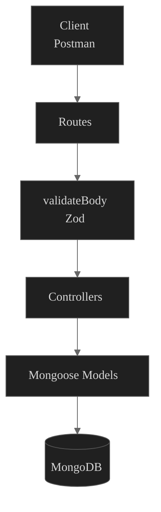

# Guitar Store API

Backend eCommerce API built with **Express**, **TypeScript**, **MongoDB**, **Mongoose**, and **Zod**.

---

### Features

- Product management
- Category management
- Guest checkout
- Order management
- Stock management
- MongoDB transactions
- Request validation with Zod
- Centralized error handling

---

### Tech Stack

- TypeScript
- Node.js
- Express
- MongoDB
- Mongoose
- Zod

---

### Project structure

```text
guitar-store/
├── src/
│   ├── controllers/
│   │   ├── categories.ts
│   │   ├── orders.ts
│   │   ├── products.ts
│   │   └── users.ts
│   │
│   ├── db/
│   │   └── index.ts
│   │
│   ├── middleware/
│   │   ├── errorHandler.ts
│   │   └── validateBody.ts
│   │
│   ├── models/
│   │   ├── Category.ts
│   │   ├── Order.ts
│   │   ├── Product.ts
│   │   └── User.ts
│   │
│   ├── routes/
│   │   ├── categoryRoutes.ts
│   │   ├── orderRoutes.ts
│   │   ├── productRoutes.ts
│   │   └── userRoutes.ts
│   │
│   ├── schemas/
│   │   ├── categorySchemas.ts
│   │   ├── orderSchemas.ts
│   │   ├── productSchemas.ts
│   │   └── userSchemas.ts
│   │
│   └── app.ts
│
├── .env
├── .gitignore
├── package.json
├── package-lock.json
├── tsconfig.json
└── README.md
```

| folder | purpose |
|---------|----------|
| **controllers** | Implements the business logic for each endpoint. |
| **db** | Connects the application to MongoDB. |
| **middleware** | Contains reusable Express middleware such as request validation and centralized error handling. |
| **models** | Defines the MongoDB collections using Mongoose schemas. |
| **routes** | Maps API endpoints to their corresponding controllers. |
| **schemas** | Validates incoming request bodies using Zod before they reach the controllers. |




### API endpoints
(e.g. products)
```
GET /api/products
GET /api/products/:id
POST /api/products
PUT /api/products/:id
DELETE /api/products/:id
```

### Categories
```
- electric guitar
- bass guitar
- acoustic guitar
- amplifier
- pedal
- strap
```
---

### **Design decisions**

#### - guest checkout

Orders store customer information instead of requiring user registration.

#### - historical prices

Each order stores the product price at the time of purchase.

#### - inventory management

Stock is reduced automatically after a successful order.

#### - transactions

Order creation and stock updates run inside a MongoDB transaction to guarantee consistency.

---

### Project Setup

#### 1.1. create the project

```bash
mkdir guitar-store
cd guitar-store
```

#### 1.2. initialize Node.js

```bash
npm init -y
```

#### 1.3. configure the project

Added to `package.json`:

```json
"type": "module"
```

#### 1.4. install dependencies

```bash
npm install express mongoose cors zod
```

#### 1.5. install development dependencies

```bash
npm install -D typescript @types/node @types/express @types/cors
```

#### 1.6. configure tsconfig.json

#### 1.7. run

```bash
npm run dev
```
#### 1.8. deployment

```bash
npm run build
npm start
```